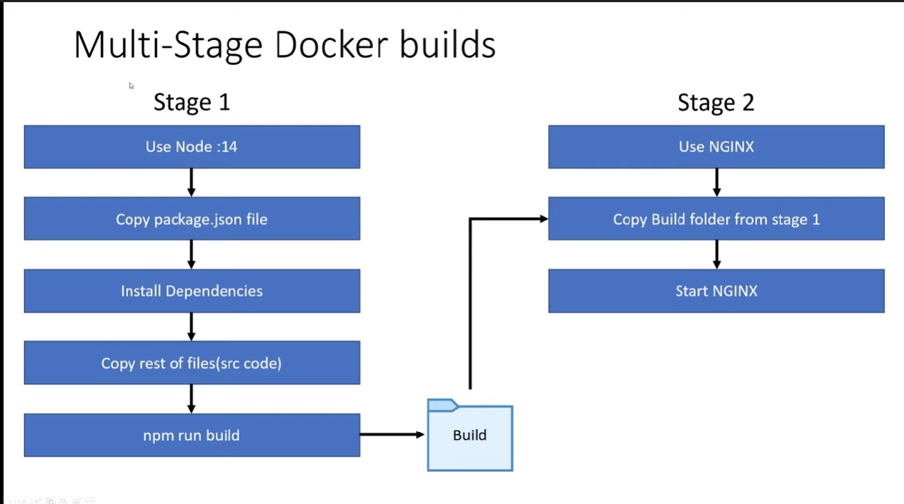

# Docker + ReactJS tutorial: Development to Production workflow + multi-stage builds + docker compose

## !! Warning REACT Hotreload doesn't work somehow :/

### ```docker build .```
## Available Scripts

In the project directory, you can run:

### ```docker build .```

Runs the app in the development mode.\
Open [http://localhost:3000](http://localhost:3000) to view it in your browser.

Access to remote machine container
### ```docker exec -it react-app bash```

Remove container (force)
### ```docker rm react-app -f```

Access folders in src file
### ```cd /src` ### `cat App.js```

Syncing Local : Remote (Powershell)

### ```docker run -v CHOKIDAR_USEPOLLING=true ${pwd}:/app -d -p 3000:3000 --name react-app react-image```

Syncing Local : Remote (CMD)

### `docker run -v CHOKIDAR_USEPOLLING=true %cd%:/app -d -p 3000:3000 --name react-app react-image`

Syncing Local : Remote (Linux)

### ```docker run -v CHOKIDAR_USEPOLLING=true $(pwd):/app -d -p 3000:3000 --name react-app react-image```


Read only from remote machine (v : ro)

### ```docker run -e CHOKIDAR_USEPOLLING=true -v %cd%\src:/app/src:ro -d -p 3000:3000 --name react-app react-image```


Docker compose watch Dockerfile

### ```docker compose up -d --build```

Docker build target file by '-f' flag

### ```docker build -f ./Dockerfile.dev .```

Docker build target file by '-f' flag -- docker compose

### ```docker-compose -> services -> react-app -> build : context : . , dockerfile : Dockerfile.dev```

Stages of docker builds

Copy build folder from stage 1 and serve it with nginx 


### On production Dockerfile changes latest layer

### ```npm run build```

FROM nginx

# Copy the output of the -npm run build-
COPY --from=build /app/build /usr/share/nginx/html`

### Build docker-compose-dev file in one command
```docker compose -f docker-compose.yaml -f docker-compose-dev.yaml up -d --build```


### Build docker-compose-prod file in one command
```docker compose -f docker-compose.yaml -f docker-compose-prod.yaml up -d --build```

### Stop multi docker-compose file in one command
```docker compose -f docker-compose.yaml -f docker-compose-prod.yaml down```

### Build multistage by targeting Dockerfile.prod FROM 'as build' etc. (it will not run nginx stage)
```docker build --target build -f Dockerfile.prod -t multi-stage-example .```